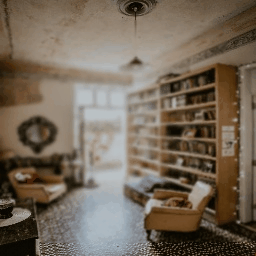

# 🚀StackMFF🚀
Official PyTorch implementation of "StackMFF: End-to-end Multi-Focus Image Stack Fusion Network"
# 🌼Abstract
Existing end-to-end multi-focus image fusion networks work well for merging two images but suffer from various types of image degradation when applied to image stacks. To address this issue, we propose a novel 3D CNN approach for end-to-end fusion of entire multi-focus image stacks. Furthermore, we developed a synthesis pipeline based on monocular depth estimation to create a large-scale dataset for training. To improve the fusion quality, we introduce a 3D coordinate adaptive enhancement module to amplify and emphasize high-frequency information. Additionally, we establish a benchmark for multi-focus image stack fusion tasks and release a comprehensive toolbox containing 12 different algorithms to facilitate consistent evaluation and comparison. Extensive experiments show that our method can effectively fuse multi-focus image stacks while reducing image degradation, achieving state-of-the-art performance in fusion quality and processing speed.


# ⭐Highlights
- Proposes the first network specifically designed for multi-focus image stack fusion.
- Introduces a novel pipeline for synthesizing image stacks based on depth estimation.
- Establishes a benchmark for the multi-focus image stack fusion task.
- Releases a multi-focus image stack fusion toolbox containing 12 algorithms.
- Achieves state-of-the-art fusion performance and processing speed.

## 🔨Installation (GPU)
- pytorch 1.13.0
- torchvision 0.14.0
- opencv-python 4.9.0.80
- pillow 10.2.0
- tensorboardX 2.6.22
- tqdm 4.66.2

## ✈️Inference
### If you want to inference datasets, run:
```
python predict_dataset.py --model_path checkpoint/checkpoint.pth --stack_basedir_path data/Datasets_StackMFF/4D-Light-Field/image stack
```
### If you want to inference a image stack, run:
```
python predict.py --model_path checkpoint/checkpoint.pth --stack_path data/Datasets_StackMFF/4D-Light-Field/image stack/boxes
```

## ✈️Train
### 1. Download datasets for training
Download the validation set of the original dataset [Open Images V7](https://github.com/cvdfoundation/open-images-dataset#download-full-dataset-with-google-storage-transfer) used to make the training dataset, and put all images to 'data/OpenImagesV7'.
### 2. Split the datasets
Split the datasets validation set of the original dataset [Open Images V7](https://github.com/cvdfoundation/open-images-dataset#download-full-dataset-with-google-storage-transfer) into 2 training sets and validation sets by running the following command:
```
python split_dataset.py
```
### 3. Get depth maps
Using [Metric3D](https://github.com/YvanYin/Metric3D) to get depth maps (8bit, range from 0 to 255) for all images, and put all depth maps to 'data/OpenImagesV7/train_depth' and 'data/OpenImagesV7/test_depth', respectively. Then, using depth-adapted multi-Focus simulation (DAMS) to get multi-focus image stacks, run:
```
python make_dataset.py
```
### 4. Train StackMFF
The training code will be released after the article is accepted.

## 🌈Prepare datasets for evaluation
We have prepared all the evaluation datasets for you, which can be downloaded [here](https://pan.baidu.com/s/1n68SffCOg5RpzRgCIuuy4g?pwd=cite).
Put Datasets_StackMFF to data/Datasets_StackMFF

If you want to make your own evaluation dataset, please refer to the following:

### 1. 4D Light Field
Download [4D-Light-Field](https://lightfield-analysis.uni-konstanz.de/) dataset
Put full_data.zip under ./data/4D-Light-Field_Gen
Run the following command under ./data/4D-Light-Field_Gen

```
unzip full_data.zip
python LF2hdf5.py --base_dir ./full_data --output_dir ./LF
python FS_gen.py --LF_path ./LF/HCI_LF_trainval.h5 --output_dir ./FS
python save_AiF.py ./FS/HCI_FS_trainval.h5 ./FS
python save_stack.py ./FS/HCI_FS_trainval.h5 ./FS
```

### 2. FlyingThings3D Dataset
Download [FlyingThings3D_FS](https://drive.google.com/file/d/19n3QGhg-IViwt0aqQ4rR8J3sO60PoWgL/view?usp=sharing) under ./data/FlyingThings3D/
Unzip the dataset

### 3. Middlebury Dataset

Download [Middlebury_FS](https://drive.google.com/file/d/1FDXf47Qp1-dT_C7bo30ZySvvPAgJf5FU/view?usp=sharing) under 'data/Middlebury'
Unzip the dataaset
Mobile Depth Dataset

### 4. Mobile Depth Dataset
Download [Mobile Depth](https://www.supasorn.com/dffdownload.html) dataset under 'data/Mobile_Depth_Gen'
Run the following command under ./data/Mobile_Depth_Gen
```
mkdir Photos_Calibration_Results
mv depth_from_focus_data2.zip Photos_Calibration_Results
cd Photos_Calibration_Results
unzip ./depth_from_focus_data2.zip
mv calibration/metal calibration/metals
mv calibration/GT calibration/zeromotion
mv calibration/GTSmall calibration/smallmotion
mv calibration/GTLarge calibration/largemotion
cd ..
unzip depth_from_focus_data3.zip
```

## ✅Depth-adapted multi-focus simulation

Common:

Proposed:



## ✅Download
### 1. [Fusion results of various methods](https://pan.baidu.com/s/1PSZLc-wvsePbqXATl3ZOpg?pwd=cite)
### 2. The toolbox of multi-focus image fusion is being integrated and we will release it as soon as possible.
